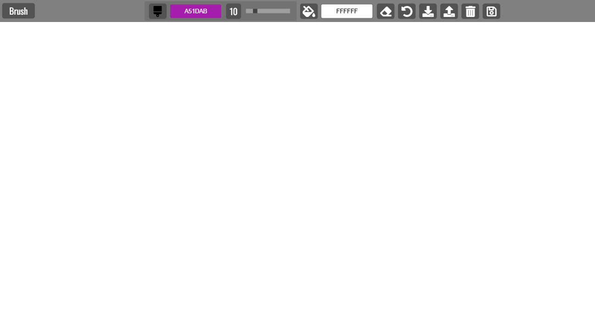

# Paint Clone | ZTM JS Web Projects Course

**Project 19/20**

A fully functional **Paint Clone app** built with HTML, CSS, and JavaScript. It allows users to draw on a canvas with different brush sizes and colors, erase parts of their drawing, change the background color, and even save/load their artwork using **local storage**. Users can also download their creations as image files.

---

## 📚 Table of Contents

- [🔎 Overview](#-overview)
  - [📸 Screenshot](#-screenshot)
  - [🔗 Links](#-links)
  - [📌 Features](#-features)
  - [🛠️ Built with](#️-built-with)
- [🧠 My process](#-my-process)
  - [🗃️ Useful resources](#️-useful-resources)
  - [🔙 Previous Project](#-previous-project)
  - [🔜 Next Project](#-next-project)
- [👤 Author](#-author)
  - [🌐 Connect with Me](#-connect-with-me)
  - [💻 Coding Profiles](#-coding-profiles)

---

## 🔎 Overview

### 📸 Screenshot

### 🔗 Links

- [🔴 Live Demo](https://dalascript.github.io/paint-clone/)
- [🗂️ GitHub Repository](https://github.com/DalaScript/paint-clone)

### 📌 Features

- ✅ Customizable brush size & color
- ✅ Bucket tool for background color
- ✅ Eraser tool
- ✅ Clear canvas with one click
- ✅ Save & load from Local Storage
- ✅ Download drawings as JPEG
- ✅ Responsive canvas
- ✅ Mobile warning for UX

### 🛠️ Built with

- HTML5
- CSS3
- JavaScript
- localStorage
- Canvas API
- jscolor.js

---

## 🧠 My Process

### 🗃️ Useful resources

- [Font Awesome – Free Icons](https://fontawesome.com/icons?d=gallery&m=free)  
- [W3Schools – Range Slider](https://www.w3schools.com/howto/howto_js_rangeslider.asp)  
- [W3Schools – Window innerHeight](https://www.w3schools.com/jsref/prop_win_innerheight.asp)  
- [jscolor – Color Picker](https://jscolor.com/)  
- [MDN – Canvas API Tutorial](https://developer.mozilla.org/en-US/docs/Web/API/Canvas_API/Tutorial)  
- [W3Schools – Mouse Events](https://www.w3schools.com/jsref/obj_mouseevent.asp)  
- [MDN – Drawing Shapes](https://developer.mozilla.org/en-US/docs/Web/API/Canvas_API/Tutorial/Drawing_shapes)  
- [MDN – getBoundingClientRect()](https://developer.mozilla.org/en-US/docs/Web/API/Element/getBoundingClientRect)  
- [MDN – CanvasRenderingContext2D](https://developer.mozilla.org/en-US/docs/Web/API/CanvasRenderingContext2D)  
- [MDN – HTMLCanvasElement.toDataURL()](https://developer.mozilla.org/en-US/docs/Web/API/HTMLCanvasElement/toDataURL)  

### 🔙 Previous Project

- Splash Page | *Project 18/20* → [View Repository](https://github.com/DalaScript/splash-page)

### 🔜 Next Project

- Pong | *Project 20/20* → [View Repository](https://github.com/DalaScript/pong)

---

## 👤 Author

### 🌐 Connect with Me

- [Instagram](https://www.instagram.com/DalaScript)
- [YouTube](https://www.youtube.com/@DalaScript)

### 💻 Coding Profiles

- [freeCodeCamp](https://www.freecodecamp.org/DalaScript)
- [FrontendMentor](https://www.frontendmentor.io/profile/DalaScript)
- [GitHub](https://github.com/DalaScript)

*🙌 Thanks for checking out my project! More coming soon. Stay tuned 🚀*
